# Architecture Documentation

## System Overview

The OFS Mockup Server is a lightweight FastAPI-based application that simulates the complete OFS (Open Fiscal Server) API for testing fiscal device integration without requiring physical hardware. It provides realistic responses for all fiscal operations commonly used in Bosnia and Herzegovina, Serbia, and other Balkan regions.

## High-Level Architecture

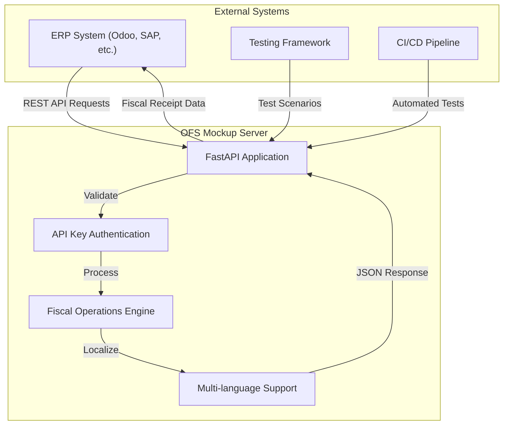

## Component Architecture

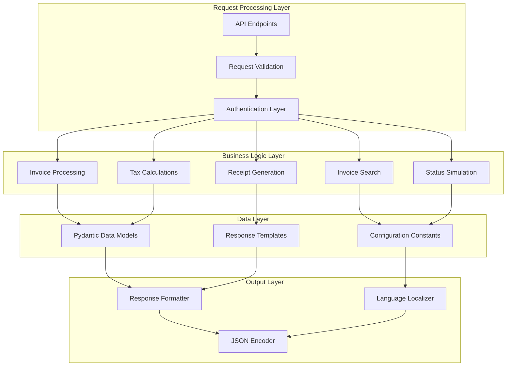

## Data Flow Architecture

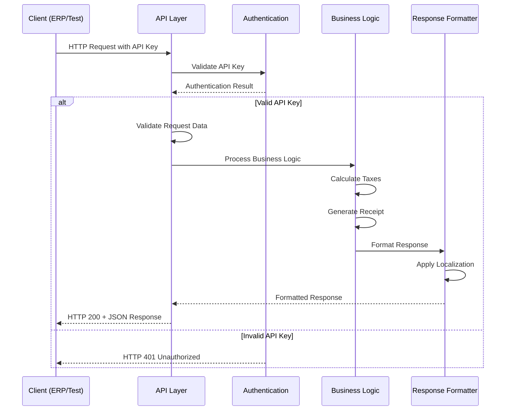

## Module Architecture

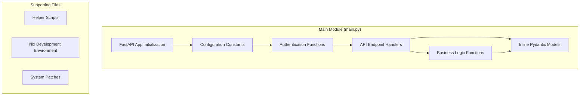

## API Architecture

### Endpoint Categories

```mermaid
graph TB
    subgraph "Public Endpoints"
        ROOT[GET / - Health Check]
    end
    
    subgraph "Authenticated Endpoints"
        ATTENTION[GET /api/attention - Service Check]
        STATUS[GET /api/status - Device Status]
        PIN[POST /api/pin - PIN Authentication]
        INVOICES[POST /api/invoices - Process Invoices]
        SEARCH[POST /api/invoices/search - Search Invoices]
        DETAILS[GET /api/invoices/{id} - Invoice Details]
    end
    
    ROOT --> ATTENTION
    ATTENTION --> STATUS
    STATUS --> PIN
    PIN --> INVOICES
    INVOICES --> SEARCH
    SEARCH --> DETAILS
```

### Authentication Flow

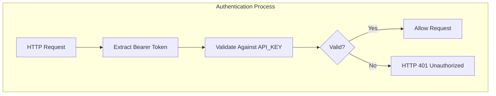

## Data Model Architecture

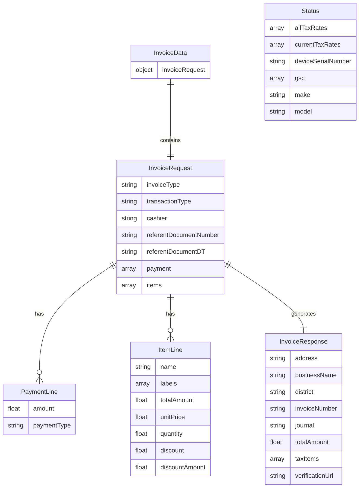

## Configuration Architecture

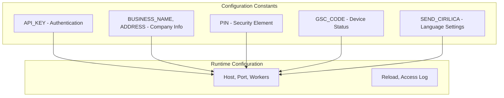

## Tax System Architecture

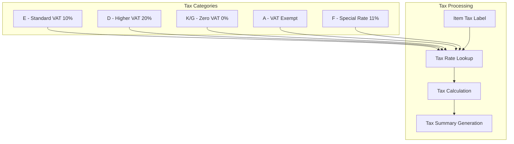

## Multi-language Architecture

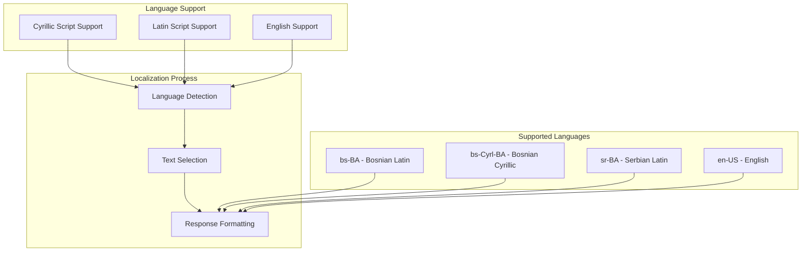

## Error Handling Architecture

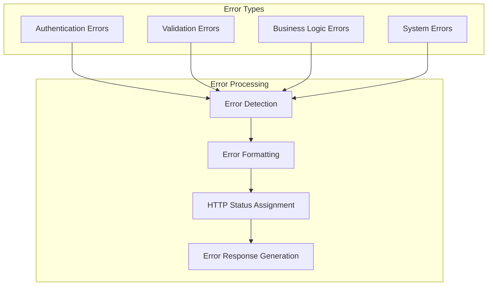

## Testing Architecture

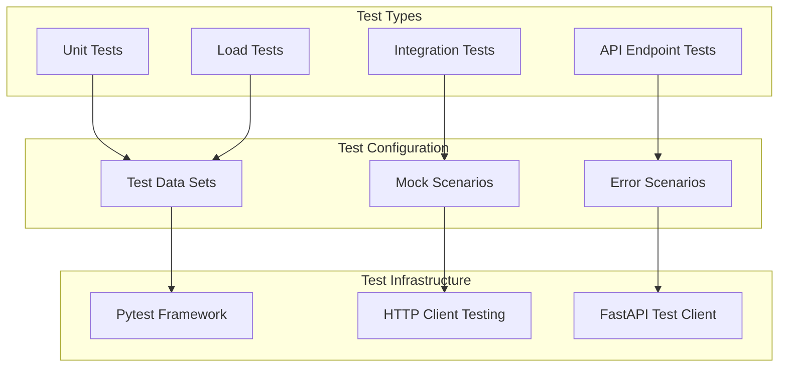

## Deployment Architecture

```mermaid
graph TB
    subgraph "Development Environment"
        NIX_ENV[Nix Development Environment]
        LOCAL_SERVER[Local Uvicorn Server]
        DEV_CONFIG[Development Configuration]
    end
    
    subgraph "Testing Environment"
        CI_RUNNER[CI/CD Runner]
        TEST_SERVER[Test Server Instance]
        AUTOMATED_TESTS[Automated Test Suite]
    end
    
    subgraph "Production-like Environment"
        DOCKER_CONTAINER[Docker Container]
        LOAD_BALANCER[Load Balancer]
        MONITORING[Health Monitoring]
    end
    
    NIX_ENV --> LOCAL_SERVER
    LOCAL_SERVER --> DEV_CONFIG
    
    CI_RUNNER --> TEST_SERVER
    TEST_SERVER --> AUTOMATED_TESTS
    
    DOCKER_CONTAINER --> LOAD_BALANCER
    LOAD_BALANCER --> MONITORING
```

## Performance Characteristics

### Scalability Design
- **Stateless Architecture** - No session storage, fully stateless
- **Single Process** - Designed for testing, not high-load production
- **Fast Response Times** - In-memory processing, no database queries
- **Concurrent Requests** - FastAPI async support for concurrent testing

### Resource Usage
- **Minimal Memory** - Lightweight application with embedded data
- **Low CPU Usage** - Simple request processing without heavy computation
- **No External Dependencies** - Self-contained server with no external services
- **Fast Startup** - Quick server initialization for testing environments

This architecture provides a complete, realistic simulation of fiscal device functionality while maintaining simplicity and reliability for testing scenarios.