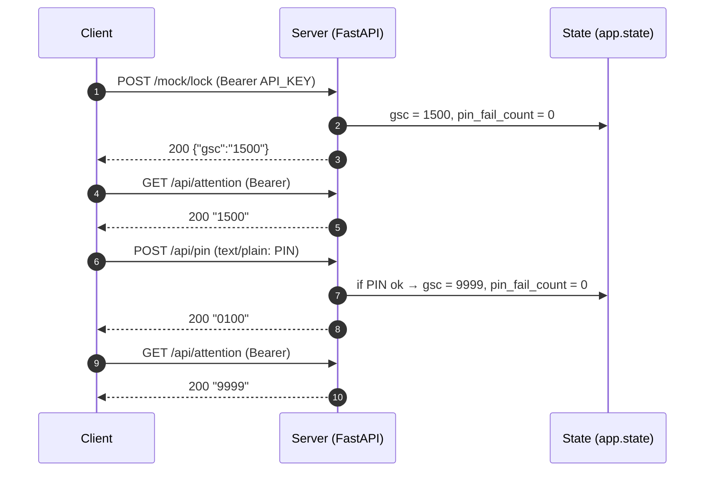
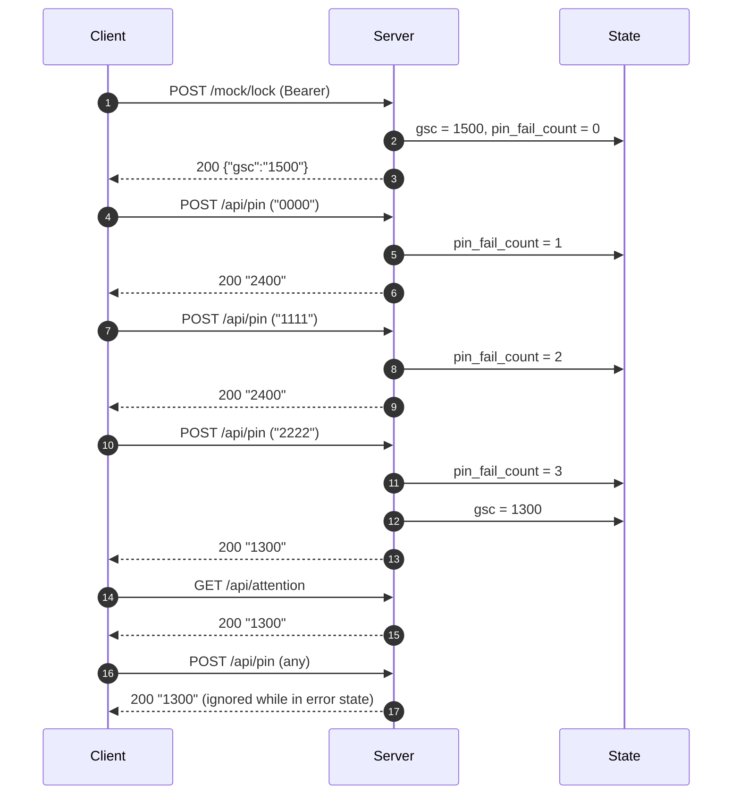
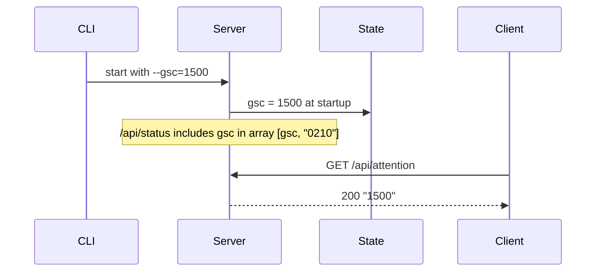
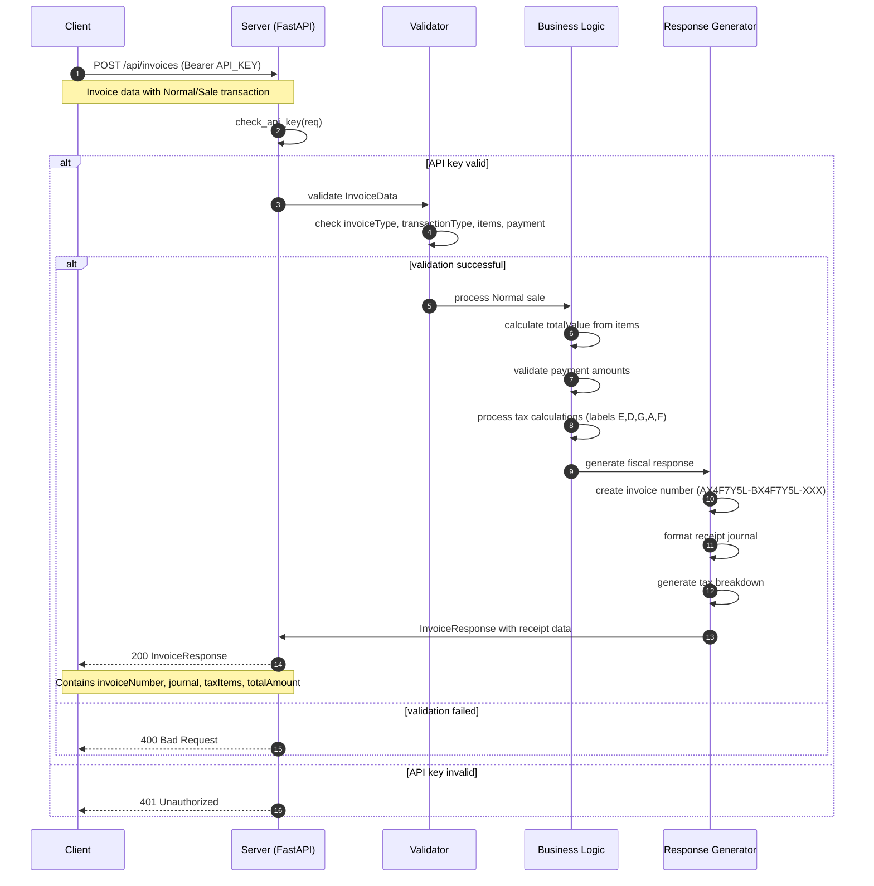
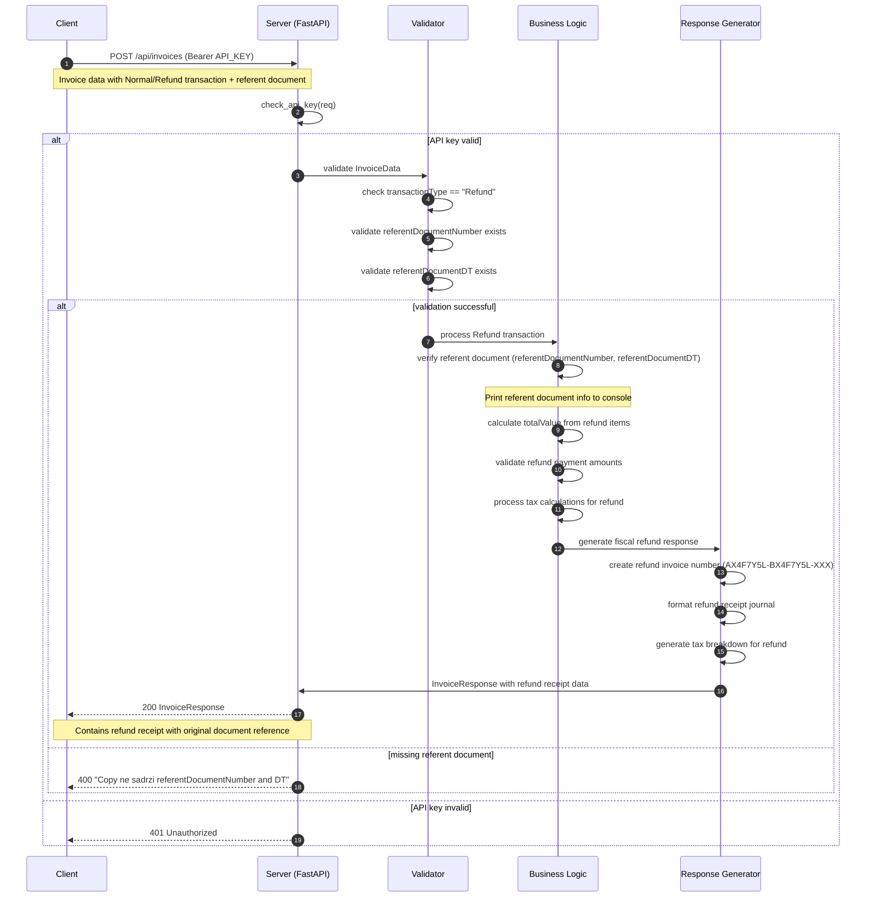

# Sequence Diagrams

Below workflows illustrate GSC-driven authentication and PIN handling in the mock server. Diagrams use Mermaid syntax; render in a compatible viewer or GitHub.

## PIN Unlock Flow


## Wrong PIN Lockout (3 strikes → 1300)


## Init Parameter (--gsc)


## Regular Invoice Processing


## Refund Invoice Processing


```
Notes
- GSC codes: 1300 = security error; 1500 = PIN required; 9999 = OK (PIN entered).
- /api/status mirrors current GSC in `gsc` list along with other status codes.
- /api/pin accepts `text/plain` only.
- Invoice processing requires valid Bearer token authentication.
- Refund transactions must include referentDocumentNumber and referentDocumentDT.
- Tax calculations based on item labels: E (10%), D (20%), G/K (0%), A (exempt), F (11%).
```
