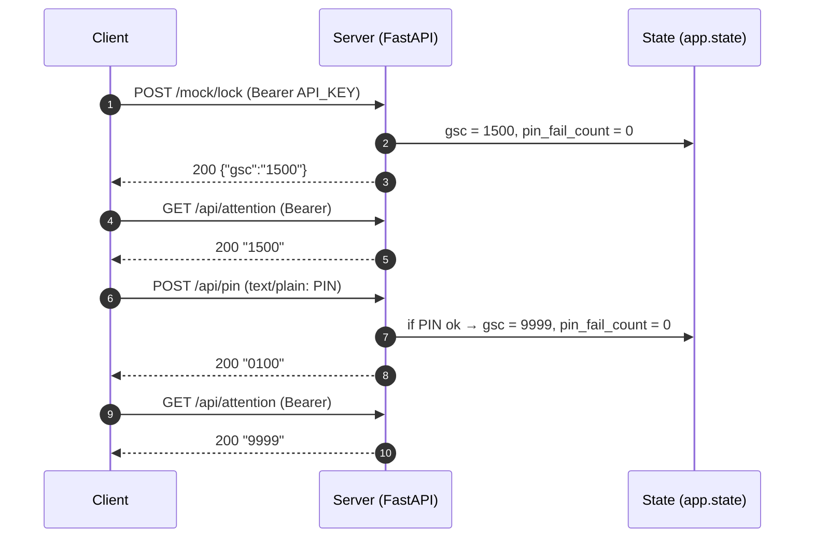
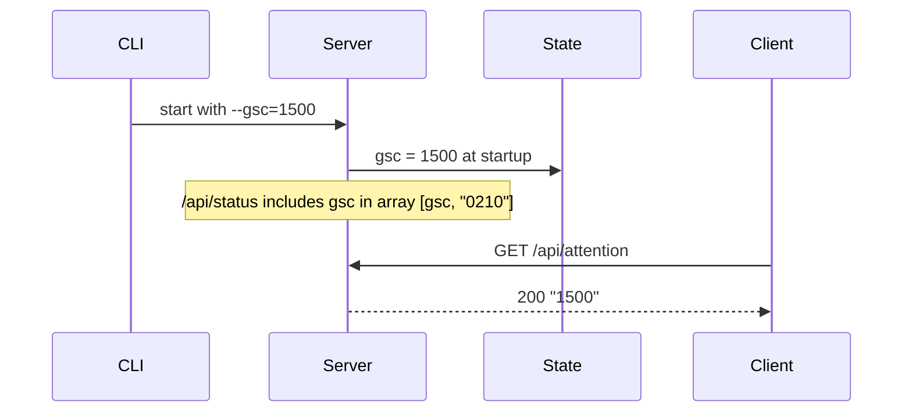

# Sequence Diagrams

Below workflows illustrate GSC-driven authentication and PIN handling in the mock server. Diagrams use Mermaid syntax; render in a compatible viewer or GitHub.

## PIN Unlock Flow


## Wrong PIN Lockout (3 strikes → 1300)
```mermaid
sequenceDiagram
    autonumber
    participant C as Client
    participant S as Server
    participant ST as State

    C->>S: POST /mock/lock (Bearer)
    S->>ST: gsc = 1500, pin_fail_count = 0
    S-->>C: 200 {"gsc":"1500"}

    C->>S: POST /api/pin ("0000")
    S->>ST: pin_fail_count = 1
    S-->>C: 200 "2400"

    C->>S: POST /api/pin ("1111")
    S->>ST: pin_fail_count = 2
    S-->>C: 200 "2400"

    C->>S: POST /api/pin ("2222")
    S->>ST: pin_fail_count = 3; gsc = 1300
    S-->>C: 200 "1300"

    C->>S: GET /api/attention
    S-->>C: 200 "1300"

    C->>S: POST /api/pin (any)
    S-->>C: 200 "1300" (ignored while in error state)
```

## Init Parameter (--gsc)


```
Notes
- GSC codes: 1300 = security error; 1500 = PIN required; 9999 = OK (PIN entered).
- /api/status mirrors current GSC in `gsc` list along with other status codes.
- /api/pin accepts `text/plain` only.
```
