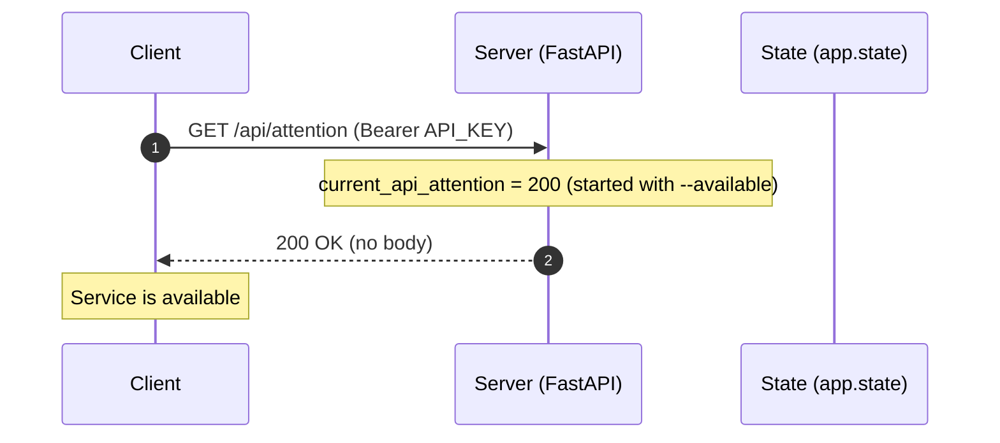
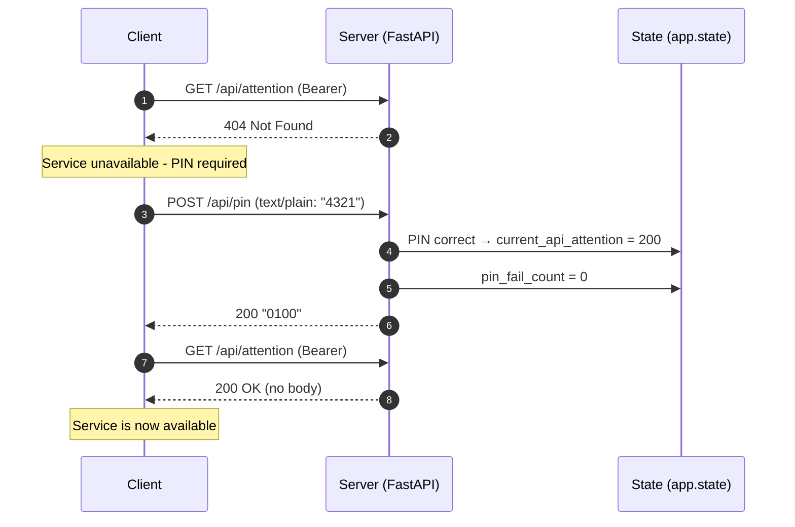
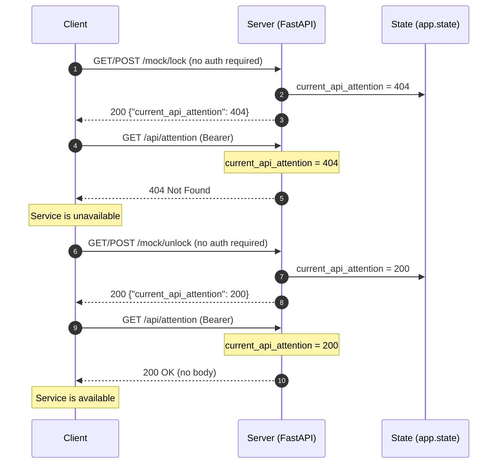
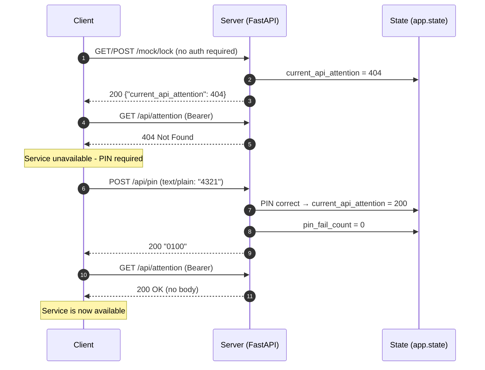
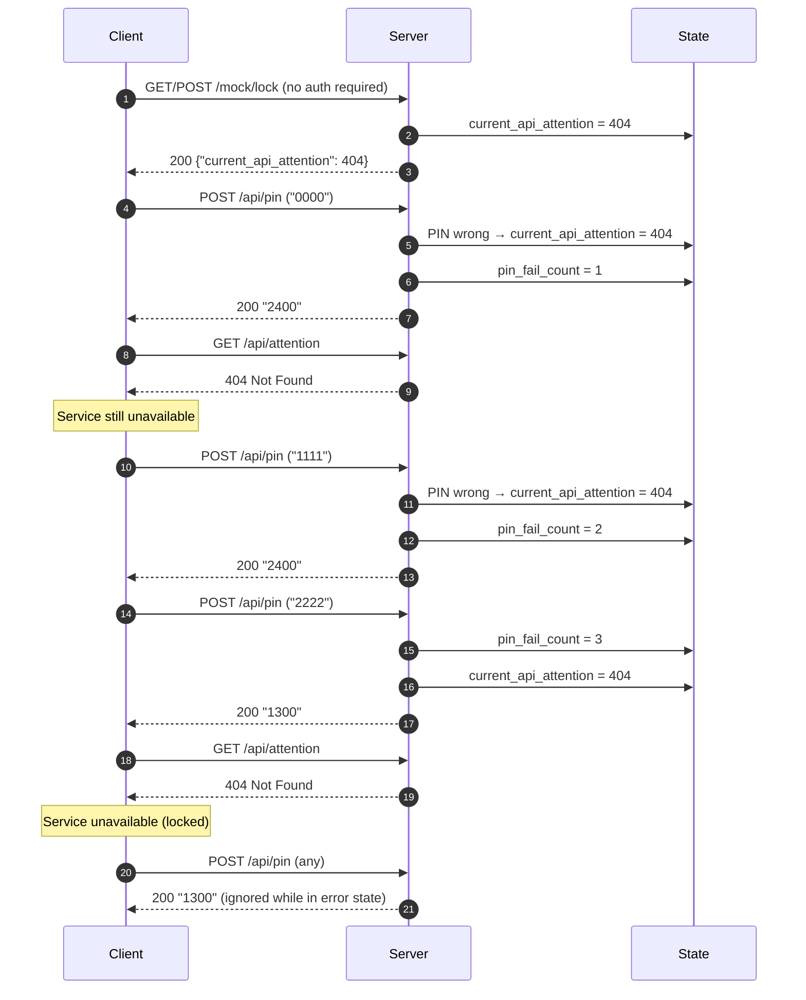
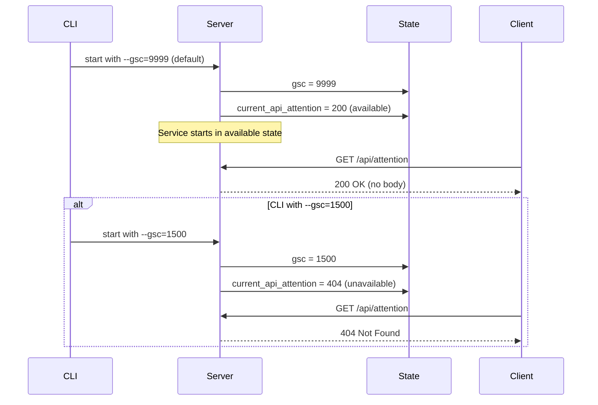
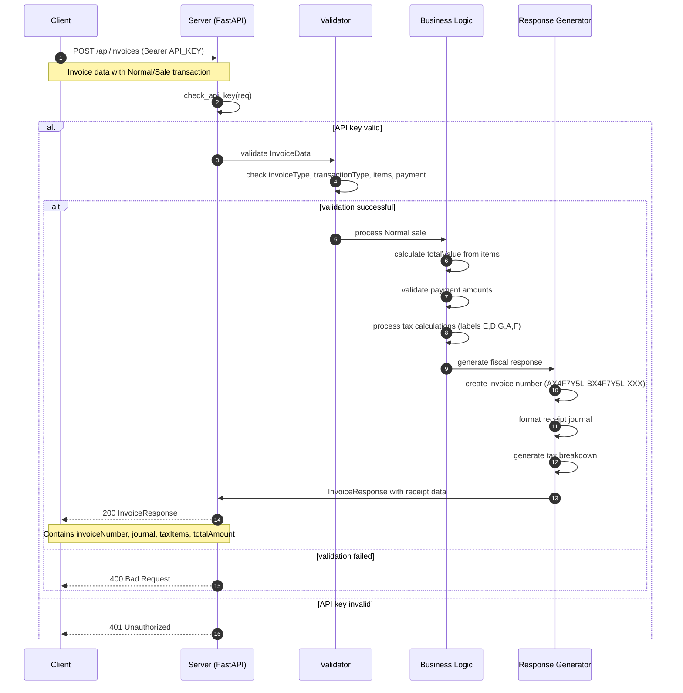
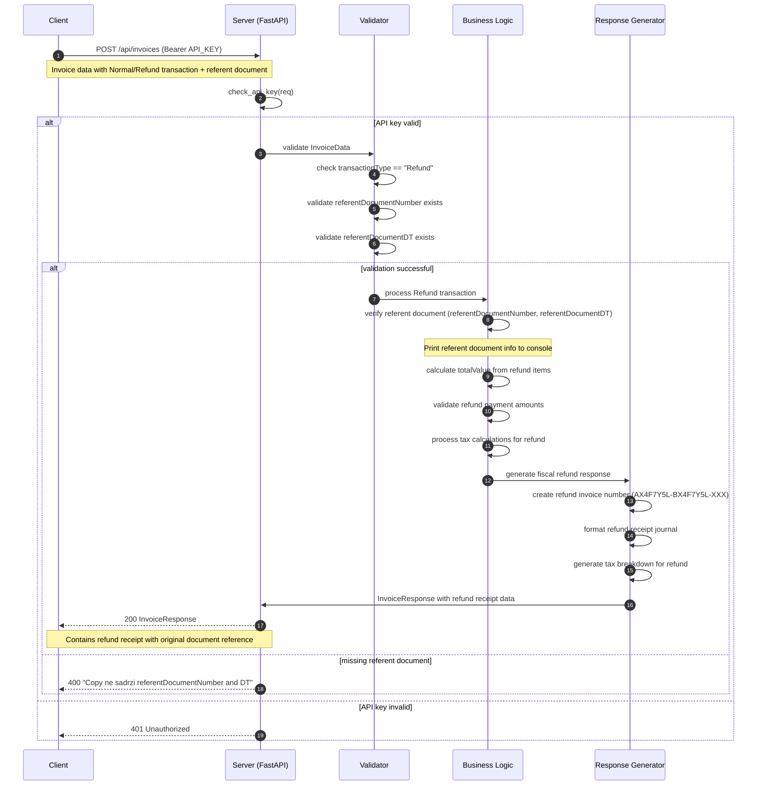

# Sequence Diagrams

Below workflows illustrate the new HTTP status-based service availability system and PIN handling in the mock server. Diagrams use Mermaid syntax; render in a compatible viewer or GitHub.

## Service Availability Check Flow, system available

## Service Availability Check, system request PIN

## Service Lock/Unlock Flow

## PIN Integration Flow

## PIN Failure Flow

## Server Startup Flow

## Regular Invoice Processing

## Refund Invoice Processing

## Key Changes from Previous Version

### Service Availability System
- **New Approach**: HTTP status codes (200/404) instead of GSC text responses
- **current_api_attention**: New state variable controlling `/api/attention` responses
- **Default State**: 200 (available) when GSC=9999, 404 otherwise

### API Behavior Changes
- **`/api/attention`**: Returns HTTP 200 (available) or 404 (unavailable) with no response body
- **`/mock/lock`**: Sets `current_api_attention=404` and returns `{"current_api_attention": 404}`
- **`/mock/unlock`**: Sets `current_api_attention=200` and returns `{"current_api_attention": 200}`
- **`/api/pin`**: Success sets `current_api_attention=200`, failure sets `current_api_attention=404`

### Notes
- **PIN Format**: 4321 (exactly 4 digits)
- **GSC Codes**: Still used internally for device status (1300=security error, 1500=PIN required, 9999=OK)
- **API Status**: `/api/status` still returns GSC in the `gsc` array for device status information
- **PIN Authentication**: Accepts `text/plain` content-type only
- **Invoice Processing**: Requires valid Bearer token authentication
- **Refund Transactions**: Must include referentDocumentNumber and referentDocumentDT
- **Tax Calculations**: Based on item labels: E (10%), D (20%), G/K (0%), A (exempt), F (11%)